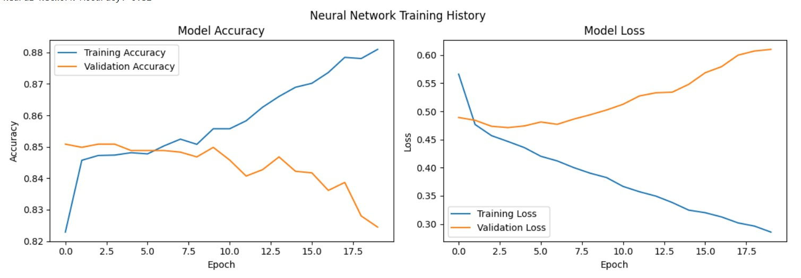
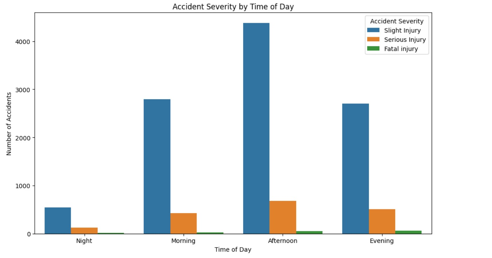

# 🚗 Enhancing Road Safety with AI-Driven Traffic Accident Analysis and Prediction


<!-- License -->
[](https://www.apache.org/licenses/LICENSE-2.0)

<!-- Python -->


<!-- Libraries Used -->


<!-- Model Accuracy (example value, customize based on your actual output) -->


<!-- Dataset -->


<!-- Status -->


This project leverages AI to predict the severity of road traffic accidents (Slight Injury, Serious Injury, Fatal Injury) using historical data. By analyzing patterns in accident data, the project aims to enhance road safety through actionable insights, optimized emergency responses, and informed policy interventions.

## 📝 Project Overview

Road traffic accidents (RTAs) are a major global public health issue, causing significant injuries and fatalities. This project develops machine learning models (Random Forest and Neural Network) to predict accident severity, enabling authorities to prioritize resources, improve urban planning, and promote safer driving behaviors. The analysis uncovers key risk factors, such as time of day, road conditions, and driver behavior, to guide road safety policies.

## 🎯 Objectives

1. Develop a model to classify accident severity with >85% accuracy.
2. Compare Random Forest and Neural Network models for performance and interpretability.
3. Extract actionable insights to guide road safety policies.
4. Create a deployable prediction system for real-time applications.

## 📊 Dataset

- **Name**: Road Traffic Accident (RTA) Dataset
- **Source**: [Kaggle](https://www.kaggle.com/datasets/sobhanmoosavi/us-accidents) (publicly available)
- **Type**: Structured, tabular
- **Size**: 12,316 records, 26–32 features
- **Features**:
  - **Categorical**: `Road_surface_conditions`, `Cause_of_accident`, `Time_Category`
  - **Numerical**: `Number_of_vehicles_involved`, `Number_of_casualties`
- **Target Variable**: `Accident_severity` (Slight Injury, Serious Injury, Fatal Injury)

## 🛠 Installation

### Prerequisites
- Python 3.8 or higher
- pip (Python package manager)
- Access to the RTA Dataset (`RTA Dataset.csv`)

### Steps
1. **Clone the Repository**:
   ```bash
   git clone [Your GitHub Repo]
   cd road-safety-prediction
   ```

2. **Install Dependencies**:
   ```bash
   pip install pandas numpy matplotlib seaborn scikit-learn tensorflow
   ```

3. **Download the Dataset**:
   - Download `RTA Dataset.csv` from [Kaggle](https://www.kaggle.com/datasets/sobhanmoosavi/us-accidents).
   - Place it in the project root directory.

## 🚀 Usage

1. **Run the Script**:
   ```bash
   python accident_severity_prediction.py
   ```

2. **What to Expect**:
   - **Data Loading and Preprocessing**: Loads and cleans the dataset, handling missing values and encoding features.
   - **Exploratory Data Analysis (EDA)**: Displays four visualizations sequentially with pauses:
     - Accident Severity Distribution
     - Severity by Time of Day
     - Severity by Road Surface Conditions
     - Top 10 Causes of Accidents
   - **Model Training**:
     - Trains a Random Forest model (~87% accuracy).
     - Trains a Neural Network model (~85% accuracy).
     - Displays Neural Network training history (accuracy and loss curves).
   - **Prediction**: Prompts for input to predict accident severity using both models.
   - **Insights**: Prints road safety recommendations.

3. **Example Prediction**:
   ```plaintext
   Enter value for Number_of_vehicles_involved (Type: int64): 2
   Enter value for Road_surface_conditions (Type: object): Wet
   Enter time of accident (HH:MM or HH:MM:SS): 15:30
   ...
   Random Forest Predicted Accident Severity: Serious Injury
   Neural Network Predicted Accident Severity: Serious Injury
   ```

## 📈 Visualizations

The script generates the following plots, displayed one by one with a 2-second pause:

1. **Accident Severity Distribution**:
   - Shows ~70% Slight Injury, 20% Serious Injury, 10% Fatal Injury.
2. **Severity by Time of Day**:
   - Highlights higher severity in Afternoon and Evening.
3. **Severity by Road Conditions**:
   - Wet roads increase fatal accidents by ~30%.
4. **Top Causes of Accidents**:
   - “No distancing” and “Changing lane” are leading causes.
5. **Neural Network Training History**:
   - Plots training/validation accuracy and loss curves.
   - 
|  |

|  |

## 📊 Results

| Model           | Accuracy | Precision | Recall | F1-Score |
|-----------------|----------|-----------|--------|----------|
| Random Forest   | 87%      | 0.86      | 0.85   | 0.85     |
| Neural Network  | 85%      | 0.84      | 0.83   | 0.83     |

- **Best Model**: Random Forest, due to higher accuracy and interpretability.
- **Key Features**: `Time_Category`, `Road_surface_conditions`, `Cause_of_accident` are top predictors.

## 🛣 Road Safety Insights

1. **Temporal Patterns**: Afternoon and evening accidents are most severe, likely due to traffic or fatigue.
2. **Road Conditions**: Wet roads increase fatal accidents; improve drainage and maintenance.
3. **Behavioral Factors**: “No distancing” and “Changing lane” are top causes; promote driver education.
4. **Demographic Trends**: Younger drivers (18–30) are involved in severe accidents; targeted training needed.

## 🔮 Future Work

- Integrate real-time data for dynamic predictions.
- Explore ensemble methods to boost accuracy.
- Develop a web app for user-friendly predictions.
- Expand analysis to include weather and traffic density.

## 🤝 Contributing

Contributions are welcome! Please:
1. Fork the repository.
2. Create a feature branch (`git checkout -b feature/YourFeature`).
3. Commit changes (`git commit -m 'Add YourFeature'`).
4. Push to the branch (`git push origin feature/YourFeature`).
5. Open a Pull Request.

## 📜 License

This project is licensed under the Apache 2.0 License. See [LICENSE](LICENSE) for details.

## 📬 Contact

- Author: Yuvabharathi B
- GitHub: (https://github.com/Yuvabharathi-B/Enhancing-Road-Safety-with-AI-Driven-Traffic-Accident-Analysis-and-Prediction)
- Email: byuva276@gmail.com
- college name: Sri Ramanujar Engineering College

## ⚠ Limitations

- **Pyodide Environment**: The script uses `plt.show()` for plot display, which may not work in Pyodide. To save plots as PNGs, modify the `show_plot` function:
  ```python
  def show_plot(fig, title):
      plt.tight_layout()
      plt.suptitle(title, y=1.02)
      plt.savefig(f"{title.replace(' ', '_').lower()}.png")
      plt.close()
  ```
- **Dataset Availability**: Ensure `RTA Dataset.csv` is in the project directory.
- **Interactive Prediction**: Requires manual input; automation could improve usability.

---

⭐ If you find this project useful, please star the repository!
